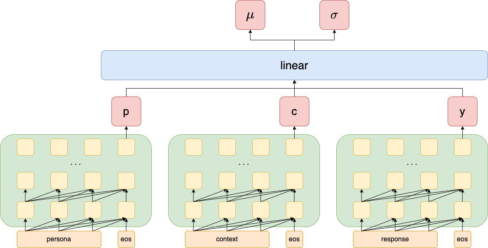
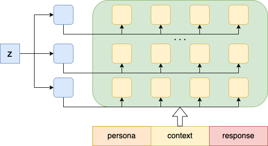
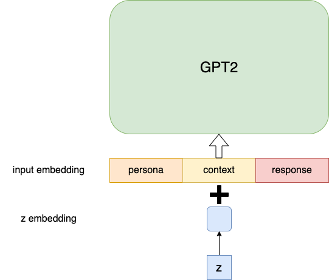
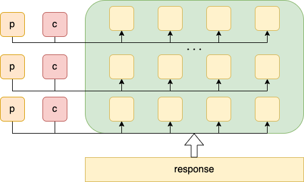

# Model Description
There are five types of chatbot implemented in the code. You can use `model_type` argument to select model. This document gives description of each model type.

## decoder

This is the baseline model. Persona, context and response are concatenated and fed into GPT2.

## cvae_memory

Persona, context and response are fed into GPT2 to get sentence level embedding. Persona_embedding, context_embedding and response embedding are concatenated and pass a linear layer to get distribution of latent space.

Then we sample z from latent space, and send z to each layer of GPT2 as extra memory.

## cvae_embedding
First get latent space distribution in the same way as `cvae_memory`.

Then sample z from latent space, and add z to GPT2 input embedding.

## compressed_decoder

We only pass response to GPT2 as input sequence. 

Persona, context are fed into GPT2 to get sentence level embedding. Then persona embedding and context embedding play the role of extra memory to GPT2.

## compressed_cvae

We only pass response to GPT2 as input sequence. 

Persona, context are fed into GPT2 to get sentence level embedding. Then persona embedding, context embedding and sampled z play the role of extra memory to GPT2.